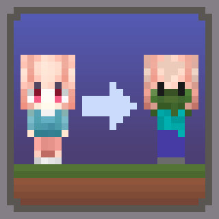
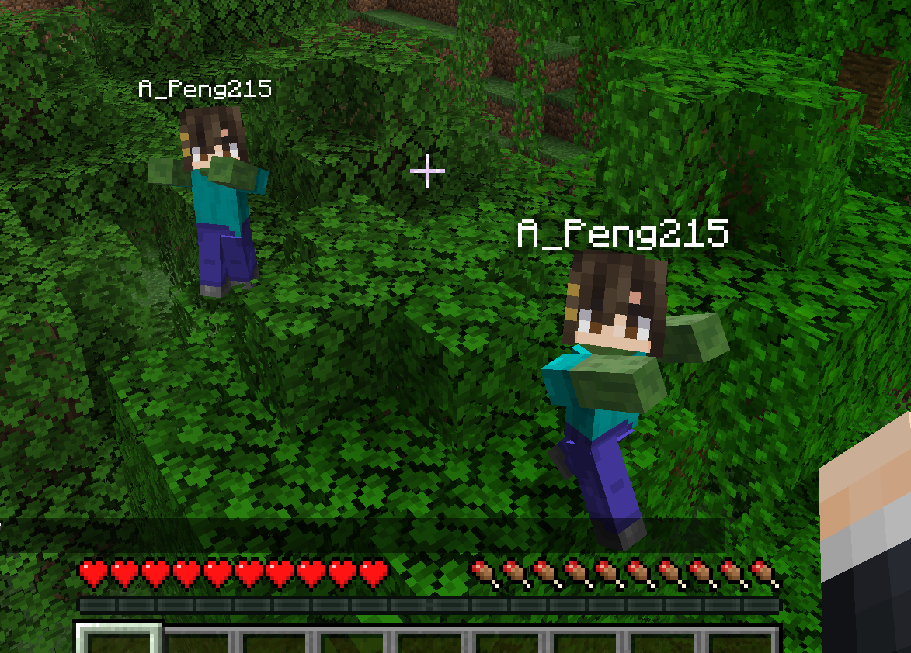

# ZombPlayer

This is a forge mod for Minecraft which spawns a zombified player when a player is killed by zombified creature.

## Features

- When a player is killed by zombified creature (including husks, drowneds etc.), a zombie will be spawned in the place.
- The zombie will inherit player's equipment and inventory. Players need to kill the zombie to retrieve them. _This feature won't work when the gamerule `keepInventory` is set to true._
- The head of the zombie is same as the player's, and will drop if killed by a __charged creeper__.
- The zombie will convert to the drowned when drowned like normal zombies.
- The zombie won't burn in sunlight.
- Type command `/gamerule doPlayerInfected [false/true]` to switch the mod. (Default true)

## Gallery

## How to Install

1. [Download]() the Jar File of proper version.
2. Copy or cut the jar file you've just downloaded to your mod path (usually ".../.minecraft/mods" or ".../.minecraft/versions/\<versionName>/mods")
3. Make sure you have installed forge of proper version.

## Feedback

Anybody could [create an issue](https://github.com/APeng215/ZombPlayer-forge/issues/new) to report bugs, give suggestions and so on.

## Credits

### Localization

- 日本語 - [Dulroy](https://space.bilibili.com/313723598)

## Release Pages

[CurseForge]()
/ [Modrinth]()
/ [GitHub]()
/ [MC百科]()

